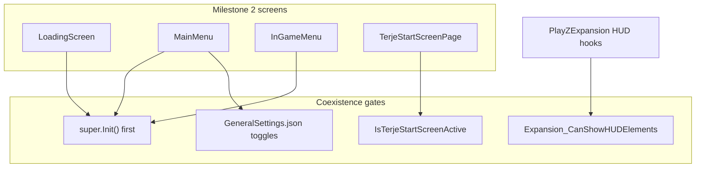

# PlayZUI integration bridges

Cross-cutting rules for PlayZUI milestone 2 screen rewrites. Synthesizes vanilla, PlayZ sibling, Terje, and Expansion doc trees.

## Golden rules

1. **One `modded class` per file** — name file after the class.
2. **`super.Init()` first** on MainMenu, InGameMenu, OptionsMenu, KeybindingsMenu.
3. **Preserve widget names** — downstream mods bind by string.
4. **Load order** — `PlayZCore → PlayZGunPlay → PlayZTerje* → PlayZUI → PlayZExpansion`.
5. **Do not touch `IngameHud` in PlayZUI** — nametags/HUD bridges live in PlayZExpansion.

**Source Found:** `PlayZ_Client/PlayZUI/README.md:9-30`



---

## Per-screen bridge checklist

### Loading screen

| Layer | Class | Rule |
|-------|-------|------|
| Vanilla | `LoadingScreen`, `LoadingMenu` | Keep `LoadingBar`, `ImageLogoMid/Corner`, `ImageBackground` |
| Expansion | `LoadingScreen` ctor | Logo swap on existing handles — after vanilla bind |
| PlayZUI | Custom `loading.layout` | Both engine and menu paths |

**Docs:** [vanilla/04](vanilla/04-loading-screen-lifecycle.md), [expansion/02](expansion/02-menu-overrides.md)

### Connect flow bundle

Reskin as one visual pack — layouts appear back-to-back during server connect.

| Layout | Class | Must-keep widgets |
|--------|-------|-------------------|
| `loading.layout` | `LoadingScreen`, `LoadingMenu` | `ImageBackground`, `LoadingBar`, `hint_frame`, logos |
| `dialog_queue_position.layout` | `LoginQueueBase` | `Background`, `hint_frame0`, `txtPosition`, `btnLeave` |
| `dialog_login_time.layout` | `LoginTimeBase` | `Background`, `hint_frame0`, `txtLabel`, `txtDescription`, `btnLeave` |
| `in_game_hints_load.layout` | `UiHintPanelLoading` (child) | `HeadlineLabel`, `HintDescLabel` |

Shared chrome across queue/login/loading: `BottomPanel`, `hintIcon`, `LinesImageLeft`/`LinesRightImage`, `SeparatorPanel`, `notification_root`.

**Docs:** [vanilla/15](vanilla/15-linked-screen-flows.md)

### Main menu

| Layer | Class | Rule |
|-------|-------|------|
| Vanilla | `MainMenu` | Preserve navigation widget names |
| Expansion Core | `MainMenu` | Version text after super |
| Expansion Scripts | `MainMenu` | Logo + button icons gated by GeneralSettings |
| PlayZUI | Custom layout | `super.Init()` or replicate all bindings |

**Widgets:** `play`, `settings_button`, `exit_button`, `version`, `dayz_logo`, `*_button_image`

**Docs:** [vanilla/05](vanilla/05-screen-main-menu.md), [expansion/02](expansion/02-menu-overrides.md)

### In-game menu (pause + death)

| Layer | Class | Rule |
|-------|-------|------|
| Vanilla | `InGameMenu` | Pause side effects, logout navigation |
| Expansion | `InGameMenu` | News feed on pause (GeneralSettings); death overlay **not used** (`UseDeathScreen: false`) |
| Terje | `MissionGameplay` | Dead-before-ready → vanilla death path (not PlayZ custom flow) |
| PlayZUI | `playz_ingamemenu.layout` | Pause reskin; `super.Init()` + Expansion news feed |
| PlayZUI | `playz_death_screen.layout` | Custom death: cover-based reveal, no `super.Init()` in death mode |

**Death screen:** overlay-only reveal (`death_picture_cover` / `death_buttons_cover`); block vanilla `DeathEffectTimer`, PPE death darkening, and engine `ScreenFadeIn(duration)` while menu is open. See [playz/04-death-screen.md](playz/04-death-screen.md).

**Docs:** [vanilla/06](vanilla/06-screen-ingame-menu.md), [expansion/02](expansion/02-menu-overrides.md), [playz/04-death-screen.md](playz/04-death-screen.md)

### Logout menu

| Layer | Class | Rule |
|-------|-------|------|
| Vanilla | `LogoutMenu.Init` | Binds widget members |
| PlayZCore | `LogoutMenu` | `UpdateInfo`/`Update` only — ACL logic |
| PlayZUI | Custom layout | **Must keep:** `txtLogoutTime`, `txtDescription`, `bLogoutNow`, `bCancel` |

**Docs:** [vanilla/07](vanilla/07-screen-logout-menu.md), [playz/01](playz/01-playzcore-ui.md)

### Options + keybindings

| Layer | Class | Rule |
|-------|-------|------|
| Vanilla | `OptionsMenu` | Tabber + tab sub-layouts |
| Expansion | `OptionsMenu` | Adds EXPANSION tab after super |
| PlayZGunPlay | `OptionsMenu` | Hides sUDE last tab |
| PlayZUI | Custom shell | `super.Init()` mandatory |

**Docs:** [vanilla/08](vanilla/08-screen-options-menu.md), [vanilla/09](vanilla/09-options-keybindings-architecture.md)

### Terje Start Screen pages

| Layer | Class | Rule |
|-------|-------|------|
| Terje | `TerjeStartScreenMenu` | Do not replace — RPC wizard |
| PlayZUI | `TerjeStartScreenPage*` | `GetNativeLayout()` override only |
| Terje | RPC flow | Preserve `startscreen.*` handlers |

**Docs:** [terje/02](terje/02-terje-start-screen.md), [terje/05](terje/05-playz-bridge-patterns.md)

### In-game HUD (not PlayZUI)

| Layer | Class | Rule |
|-------|-------|------|
| Expansion | `IngameHud` stack | Nametags, NV, earplugs panel |
| Terje | `IngameHud` | Badges/notifiers |
| PlayZExpansion | `IngameHud` | Terje name bridges, hide AI cooldown |
| PlayZCore | `MissionGameplay` | Earplugs overlay — `GetMenu()==null` |

**PlayZUI:** no `IngameHud` patches.

**Docs:** [expansion/03](expansion/03-ingame-hud.md), [playz/01](playz/01-playzcore-ui.md)

---

## PlayZCore checklist (every screen)

Before merging any PlayZUI screen PR:

- [ ] Logout widget names preserved (if touching logout)
- [ ] `MissionGameplay.OnUpdate` not blocked
- [ ] Earplugs toggle gated on `GetMenu() == NULL`
- [ ] OptionsMenu chains `super.Init()`
- [ ] No PlayZUI `IngameHud` overrides

**Source Found:** `PlayZ_Client/PlayZCore/scripts/5_Mission/MissionGameplay.c:42`
**Source Found:** `PlayZ_Client/PlayZCore/scripts/5_Mission/gui/LogoutMenu_AntiCombatLog.c:5-72`

---

## PlayZExpansion pointer scripts

| File | Purpose |
|------|---------|
| `PlayZExpansion/scripts/5_Mission/IngameHud.c` | Nametag Terje names, AI cooldown hide |
| `PlayZExpansion/scripts/5_Mission/ActionTargetsCursor.c` | Corpse cursor names |
| `PlayZExpansion/scripts/5_Mission/PlayZExpansionTerjeNameUI.c` | Client name gating + RPC |
| `PlayZExpansion/scripts/4_World/ExpansionGlobalChatModule.c` | Chat Terje names |
| `PlayZExpansion/scripts/4_World/ExpansionKillfeedModule.c` | Killfeed Terje names |

---

## Coexistence gates reference

| Gate | When false / blocked | Effect |
|------|---------------------|--------|
| `super.Init()` skipped | Menu open | Expansion features missing |
| `GetMenu() != null` | Pause/inventory open | Earplugs blocked; nametags hidden |
| `Expansion_CanShowHUDElements()` | Menu or ScriptView open | HUD overlays hidden |
| `GeneralSettings.UseDeathScreen` | false | PlayZUI death screen (`playz_death_screen.layout`) |
| Terje Start Screen active | Wizard open | Blocks normal gameplay input |

---

## Milestone 2 implementation template

Copy per screen when starting work:

```markdown
### Screen: [name]

**Vanilla class:** 
**MENU_* id:** 
**Layout path:** 
**PlayZUI layout path:** 

**Widget contract:**
| Widget | Required by |
|--------|-------------|

**super.Init() required:** yes/no
**PlayZCore widgets:** 
**Expansion widgets:** 
**Terje touchpoint:** 

**Test plan:**
- [ ] 
```

---

## Conflict matrix (summary)

Full matrix: [playz/03-load-order-conflicts.md](playz/03-load-order-conflicts.md), [expansion/07](expansion/07-bridge-patterns-conflicts.md).

| Priority conflict | Resolution |
|-------------------|------------|
| LogoutMenu widgets | PlayZCore ACL names mandatory |
| OptionsMenu tabs | super.Init → Expansion tab → GunPlay hide |
| IngameHud | PlayZExpansion only, not PlayZUI |
| MainMenu/InGameMenu Init | super.Init always |

---

## Doc index

| Tree | Index |
|------|-------|
| Vanilla | [vanilla/README.md](vanilla/README.md) |
| PlayZ siblings | [playz/README.md](playz/README.md) |
| Terje | [terje/README.md](terje/README.md) |
| Expansion | [expansion/README.md](expansion/README.md) |

---

## Milestone 2 implementation log

*(Fill when screens ship)*

| Screen | Status | Layout | Script | Date |
|--------|--------|--------|--------|------|
| Loading + connect shell | done | `playz_loading.layout`, `playz_dialog_queue_position.layout`, `playz_dialog_login_time.layout`, `dialog_input_password.layout` | `PlayZUILoadingScreen.c`, `PlayZUILoadingMenu.c`, `PlayZUILoginQueueBase.c`, `PlayZUILoginTimeBase.c` | 2026-06-12 |
| Main menu | pending | — | — | — |
| Death screen | done | `playz_death_screen.layout` | `PlayZUIDayZPlayerImplement.c`, `PlayZUIInGameMenu.c`, `PlayZUIMissionGameplay.c`, `PlayZUIDeathScreenState.c`, `PlayZUIPPEDeathDarkening.c`, `PlayZUIDeathScreenCompat.c`, `PlayZUIPlayerBase.c` | 2026-06-12 |
| Pause | done | `playz_ingamemenu.layout` | `PlayZUIInGameMenu.c` | 2026-06-12 |
| Logout | pending | — | — | — |
| Options | pending | — | — | — |
| Terje pages | pending | — | — | — |
