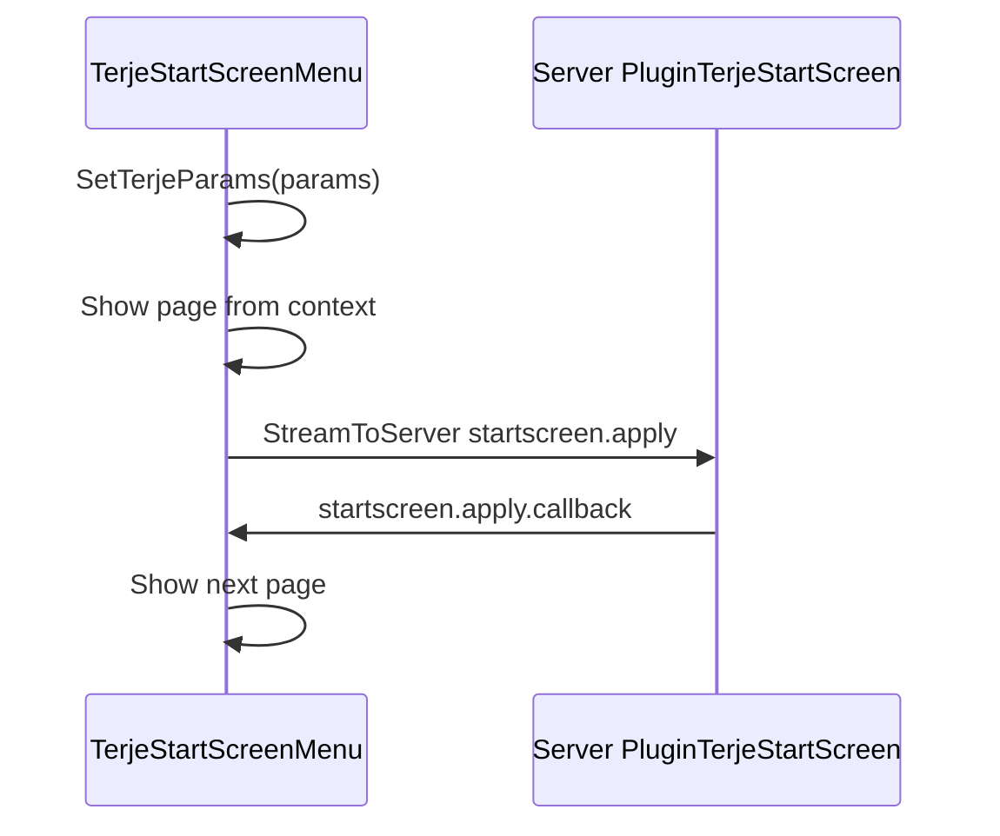

# Terje Start Screen

Post-spawn character wizard. PlayZUI restyles pages via `GetNativeLayout()` — preserve widget names and RPC flow.

## TerjeStartScreenMenu

**Source Found:** `TerjeStartScreen/Scripts/5_Mission/TerjeStartScreenMenu.c:1-200`

Extends `TerjeScriptedMenu`. User cannot close (`CanBeClosed` false, lines 172-175). Hides HUD, disables input, mutes sound (177-195).

### Widget tree (OnInit)

**Source Found:** `TerjeStartScreen/Scripts/5_Mission/TerjeStartScreenMenu.c:40-49`

1. `TerjeWidgetImage` — fullscreen background
2. `TerjeWidgetTextCentered` — loading label (`#dayz_game_loading`)
3. `TerjeWidgetMultitab` — all pages (hidden until params arrive)

## Page factory

**Source Found:** `TerjeStartScreen/Scripts/5_Mission/TerjeStartScreenPagesFactory.c:7-13`

| Tab key | Page class | Vanilla layout |
|---------|------------|----------------|
| `rules` | `TerjeStartScreenPageRules` | `TerjeStartScreen/Layouts/PageRules.layout` |
| `name` | `TerjeStartScreenPageName` | `TerjeStartScreen/Layouts/PageName.layout` |
| `face` | `TerjeStartScreenPageFace` | `TerjeStartScreen/Layouts/PageFace.layout` |
| `skills` | `TerjeStartScreenPageSkills` | `TerjeStartScreen/Layouts/PageSkills.layout` |
| `overview` | `TerjeStartScreenPageOverview` | `TerjeStartScreen/Layouts/PageOverview.layout` |
| `loadout` | `TerjeStartScreenPageLoadout` | `TerjeStartScreen/Layouts/PageLoadout.layout` |
| `map` | `TerjeStartScreenPageMap` | `TerjeStartScreen/Layouts/PageMap.layout` |

Base factory stub (empty): `TerjeCore/Scripts/5_Mission/TerjeStartScreenPagesFactory.c:1-7`.

### GetNativeLayout line refs

| Class | Lines |
|-------|-------|
| `TerjeStartScreenPageRules` | `TerjeStartScreenPageRules.c:18-21` |
| `TerjeStartScreenPageName` | `TerjeStartScreenPageName.c:29-32` |
| `TerjeStartScreenPageFace` | `TerjeStartScreenPageFace.c:15-18` |
| `TerjeStartScreenPageSkills` | `TerjeStartScreenPageSkills.c:18-21` |
| `TerjeStartScreenPageOverview` | `TerjeStartScreenPageOverview.c:5-8` |
| `TerjeStartScreenPageLoadout` | `TerjeStartScreenPageLoadout.c:40-43` |
| `TerjeStartScreenPageMap` | `TerjeStartScreenPageMap.c:32-35` |

## Client flow

**Source Found:** `TerjeStartScreen/Scripts/5_Mission/MissionGameplay.c:6-136`

### RPC handlers

| RPC | Purpose | Lines |
|-----|---------|-------|
| `startscreen.ctx` | Deserialize params onto player | 68-79 |
| `startscreen.close` | Teleport sync + close menu | 98-136 |
| `startscreen.ready` | Mark client ready, close menu | 82-96 |

### OnUpdate gate

**Source Found:** `TerjeStartScreen/Scripts/5_Mission/MissionGameplay.c:28-60`

While `player.m_terjeStartScreenClientReady == false`:
- Alive: force `TerjeStartScreenMenu` open via `TerjeUiManager.ShowScriptedMenu` (37-41)
- Params cached: `SetTerjeParams` on menu (44-47)
- Dead: close all, open `InGameMenu` + `TerjeGameRespawn()` (50-58)

## Server flow

**Source Found:** `TerjeStartScreen/Scripts/4_World/Entities/PlayerBase.c:18-59`

| Event | RPC |
|-------|-----|
| `OnTerjePlayerRespawned` | `startscreen.ctx` or `startscreen.ready` if no pages |
| `OnTerjePlayerLoaded` | `startscreen.ready` (skip wizard for returning chars) |

## Page transition flow



**Source Found:** `TerjeStartScreen/Scripts/5_Mission/TerjeStartScreenMenu.c:65-109`

### Additional RPCs

**Source Found:** `TerjeStartScreen/Scripts/4_World/PluginTerjeStartScreen.c:30-33`

| RPC | Purpose |
|-----|---------|
| `startscreen.apply` | Page advance |
| `startscreen.name.verify` | Name uniqueness |
| `startscreen.loadout.equip` | Loadout preview equip |
| `startscreen.overview.del` | Character delete |

Loadout page listens for `startscreen.loadout.ready` (`TerjeStartScreenPageLoadout.c:33`).

## Souls badge

**Source Found:** `TerjeStartScreen/Scripts/5_Mission/IngameHud.c:5-10`

`TERJE_BADGE_SOULS` counter badge when `STARTSCREEN_SOULS_BADGE` setting enabled. Displayed via `OnUpdateTerjeCustomBadges` in MissionGameplay (11-25).

## PlayZUI bridge

Override **only** `GetNativeLayout()` on page classes:

```c
modded class TerjeStartScreenPageName
{
    override string GetNativeLayout()
    {
        return PlayZUIPaths.PLAYZ_UI_ROOT + "layouts/terje/page_name.layout";
    }
}
```

**Source Found:** `PlayZ_Client/PlayZUI/scripts/3_Game/PlayZUIPaths.c:1-4`

Do **not** replace `TerjeStartScreenMenu`, `TerjeUiManager`, or `TerjeStartScreenPagesFactory` unless adding new page types.

## Related docs

- [05-playz-bridge-patterns.md](05-playz-bridge-patterns.md)
- [06-layouts-imagesets-config.md](06-layouts-imagesets-config.md)
- [../vanilla/06-screen-ingame-menu.md](../vanilla/06-screen-ingame-menu.md) (Terje respawn path)
