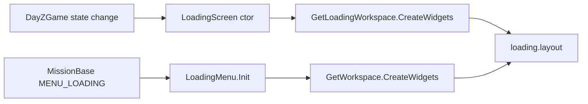

# Loading screen lifecycle

DayZ has **two** loading UI paths that share the same layout file. PlayZUI milestone 2 must treat both when reskinning `loading.layout`.

## Dual-path overview

| Path | Class | Workspace | When active |
|------|-------|-----------|-------------|
| Engine loading screen | `LoadingScreen` | `GetLoadingWorkspace()` | Connect, mission load, state transitions |
| Scripted menu | `LoadingMenu` (`MENU_LOADING`) | `GetWorkspace()` | Mission-layer loading menu |

**Source Found:** `scripts/3_Game/DayZGame.c:688-713` (`LoadingScreen` constructor)
**Source Found:** `scripts/5_Mission/GUI/LoadingMenu.c:11-35` (`LoadingMenu.Init`)

## LoadingScreen (engine class)

`LoadingScreen` is **not** a `UIScriptedMenu`. It is constructed directly by `DayZGame` and shown via `Show()` / `ShowEx()`.

**Source Found:** `scripts/3_Game/DayZGame.c:709-758` (constructor widget binding)
**Source Found:** `scripts/3_Game/DayZGame.c:820-868` (`Show` / `ShowEx`)
**Source Found:** `scripts/3_Game/DayZGame.c:1040-1047` (instantiation in `DayZGame` init)

### Constructor widget bindings

| Member | Layout widget name | Line |
|--------|-------------------|------|
| Logo mid | `ImageLogoMid` | 714 |
| Logo corner | `ImageLogoCorner` | 715 |
| Title text | `TextWidget` | 716 |
| Status | `StatusText` | 717 |
| Background | `ImageBackground` | 718 |
| Spinner | `ImageLoadingIcon` | 719 |
| Mod warning | `ModdedWarning` | 720 |
| Progress bar | `LoadingBar` | 721 |
| Progress label | `ProgressText` | 722 |
| Notifications | `notification_root` | 723 |
| Hints | `hint_frame` | 724 |

Progress hooks: `ProgressAsync.SetProgressData` / `SetUserData` at lines 756–757.

### Reference counting

`Inc()` / `Dec()` manage nested load operations (lines 763–783). `Hide()` tears down when count reaches zero (870–887).

## LoadingMenu (scripted menu)

**Source Found:** `scripts/5_Mission/GUI/LoadingMenu.c:1-40`

- Factory id: `MENU_LOADING` (12) — `scripts/3_Game/constants.c:181`
- Layout: `"gui/layouts/loading.layout"` (line 13)
- Looks up `TextWidget`, `ProgressBarWidget`, `ImageBackground` (15–17)

### Widget name mismatch (critical for PlayZUI)

The layout defines the progress bar as `LoadingBar` (`ProgressBarWidgetClass`).

**Source Found:** `gui/layouts/loading.layout:151` (`LoadingBar`)

`LoadingScreen` binds `LoadingBar` correctly. `LoadingMenu` searches for `"ProgressBarWidget"` — that name does **not** exist in the layout. PlayZUI custom layouts should expose **both** names or standardize on `LoadingBar` and patch `LoadingMenu` if needed.

## loading.layout widget inventory

**Source Found:** `gui/layouts/loading.layout`

| Widget | Type | Purpose |
|--------|------|---------|
| `TextWidget` | TextWidgetClass | Title |
| `ImageBackground` | ImageWidgetClass | Full-screen background |
| `StatusText` | TextWidgetClass | Status line |
| `ImageLogoMid` | ImageWidgetClass | Center logo |
| `ImageLogoCorner` | ImageWidgetClass | Corner logo |
| `ImageLoadingIcon` | ImageWidgetClass | Animated spinner |
| `ProgressText` | TextWidgetClass | Percent text |
| `LoadingBar` | ProgressBarWidgetClass | Progress bar |
| `hint_frame` | FrameWidgetClass | Loading hints |
| `ModdedWarning` | MultilineTextWidgetClass | Modded-server warning |
| `notification_root` | WrapSpacerWidgetClass | Notification stack |

## Random loading backgrounds

`UIManager.GetRandomLoadingBackground()` selects background images for the loading screen.

**Source Found:** `scripts/3_Game/tools/UIManager.c` (search `GetRandomLoadingBackground`)

PlayZUI reskins should preserve `ImageBackground` widget name so random background logic still applies.

## Expansion layer

Expansion swaps logo images in the `LoadingScreen` constructor (not via `super` — patches existing widget handles):

**Source Found:** `DayZExpansion/DayZExpansion/Scripts/3_Game/DayZExpansion/Client/LoadingScreen/ExpansionLoadingScreen.c:13-29`

- Replaces `ImageLogoMid` and `ImageLogoCorner` with Expansion iconset when enabled.

PlayZUI layout reskin must keep both logo widget names. Expansion logo swap runs after vanilla constructor.

## PlayZUI milestone 2 checklist

- [ ] Preserve all widget names listed above in custom `loading.layout`.
- [ ] Test both connect flow (`LoadingScreen`) and any `MENU_LOADING` path.
- [ ] Keep `LoadingBar` name; consider aliasing for `LoadingMenu` compatibility.
- [ ] Do not block `ProgressAsync` hooks — engine drives bar fill.
- [ ] Document layout path change in `14-cross-reference-index.md`.

## See also

- [15-linked-screen-flows.md](15-linked-screen-flows.md) — connect shell pack (`dialog_queue_position`, `dialog_login_time`, shared hints/backgrounds)

## Related docs

- [03-uimanager-flow.md](03-uimanager-flow.md)
- [docs/expansion/02-menu-overrides.md](../expansion/02-menu-overrides.md)
- [docs/BRIDGES.md](../BRIDGES.md)
