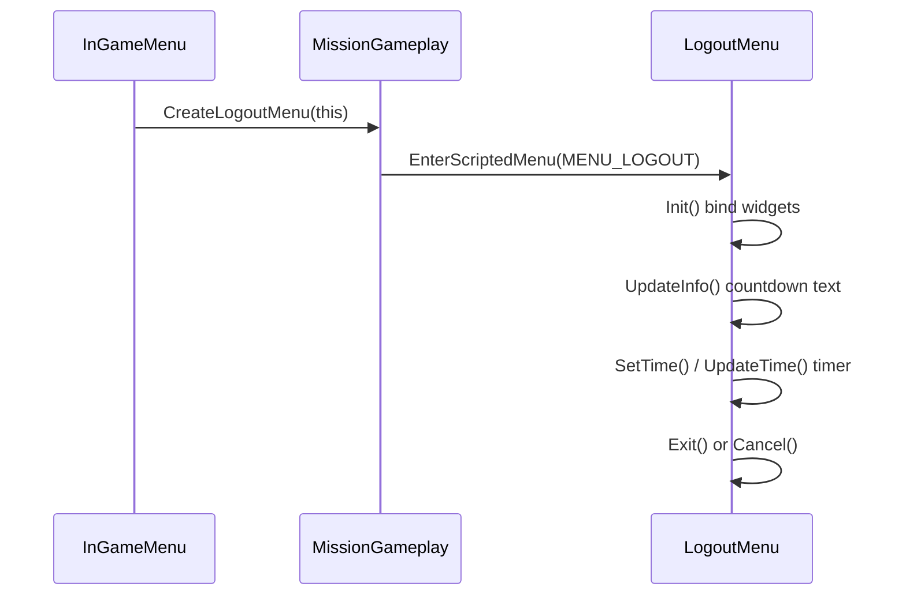

# Logout menu screen

Countdown dialog shown when the player exits from the pause menu. PlayZCore anti-combat-log patches depend on **vanilla widget names** in this layout.

## Class and factory

| Field | Value |
|-------|-------|
| Class | `LogoutMenu extends UIScriptedMenu` |
| Menu id | `MENU_LOGOUT` (26) |
| Layout | `gui/layouts/day_z_logout_dialog.layout` |
| Parent | `InGameMenu` via `EnterScriptedMenu(MENU_LOGOUT)` |

**Source Found:** `scripts/5_Mission/GUI/LogoutMenu.c:2`
**Source Found:** `scripts/5_Mission/GUI/LogoutMenu.c:45-83` (`Init`)
**Source Found:** `scripts/3_Game/constants.c:195` (`MENU_LOGOUT`)

## Widget contract (mandatory for PlayZUI)

Vanilla `Init()` binds these layout names to protected members:

| Layout widget | Script member | Line |
|---------------|---------------|------|
| `txtLogoutTime` | `m_LogoutTimeText` | 49 |
| `txtDescription` | `m_DescriptionText` | 50 |
| `bLogoutNow` | `m_bLogoutNow` | 51 |
| `bCancel` | `m_bCancel` | 52 |
| `bCancelConsole` | `m_bCancelConsole` (console) | 55 |

**Source Found:** `gui/layouts/day_z_logout_dialog.layout:36,79,119,135,152`

Additional layout widgets used in script: `SeparatorPanel`, `toolbar_bg`, `BackIcon`.

### PlayZCore dependency

`LogoutMenu_AntiCombatLog` overrides `UpdateInfo()` and `Update()` only — **not** `Init()`. It reads `m_DescriptionText` and `m_bLogoutNow` set during vanilla `Init()`.

**Source Found:** `PlayZ_Client/PlayZCore/scripts/5_Mission/gui/LogoutMenu_AntiCombatLog.c:5-72`

PlayZUI custom `day_z_logout_dialog` layout **must keep** the four PC widget names above. Renaming breaks anti-combat logout without a PlayZCore script update.

## Flow

**Source Found:** `scripts/5_Mission/mission/missionGameplay.c:1328-1376` (`CreateLogoutMenu`, `StartLogoutMenu`)

## Key methods

| Method | Role | Line |
|--------|------|------|
| Constructor | `SetKeyboardHandle(this)` | 15–18 |
| Destructor | Clears keyboard handle, cancels logout | 23–43 |
| `UpdateInfo()` | Refreshes description + timer text | ~91 |
| `SetTime(int)` | Sets countdown seconds | 135–154 |
| `UpdateTime()` | Tick countdown | 156–167 |
| `Exit()` | Confirm logout | 184–194 |
| `Cancel()` | Abort logout | 196–203 |

**Source Found:** `scripts/5_Mission/GUI/LogoutMenu.c:15-203`

## PlayZCore anti-combat behavior

When `WillBePunishedForCombatLogging()` returns non-zero:

- Description text set to `#STR_PlayZ_ACL_LogoutNote_*` stringtable keys
- Text color red (`ARGB(255,255,0,0)`)
- `m_bLogoutNow` hidden until penalty timer expires

**Source Found:** `PlayZ_Client/PlayZCore/scripts/5_Mission/gui/LogoutMenu_AntiCombatLog.c:26-47`

Stringtable keys in `PlayZ_Client/PlayZCore/stringtable.csv:7-9`:
- `STR_PlayZ_ACL_LogoutNote_Killed`
- `STR_PlayZ_ACL_LogoutNote_Flare`
- `STR_PlayZ_ACL_LogoutNote_Extended`

## Expansion layer

Namalsk Adventure recolors logout buttons after `super.Init()` — cosmetic only:

**Source Found:** `DayZExpansion/DayZExpansion/NamalskAdventure/Scripts/5_Mission/DayZExpansion_NamalskAdventure/GUI/LogoutMenu.c:14-29`

Pattern: `super.Init()` then mutate `SeparatorPanel`, `m_bCancel`, `m_bLogoutNow` colors.

## PlayZUI milestone 2 checklist

- [ ] Custom layout preserves `txtLogoutTime`, `txtDescription`, `bLogoutNow`, `bCancel`.
- [ ] Do not override `LogoutMenu.Init()` in PlayZUI unless PlayZCore is updated to re-bind widgets.
- [ ] Prefer layout-only reskin; keep PlayZCore `UpdateInfo`/`Update` patches working.
- [ ] Test ACL states: killed, flare, extended penalty.

## Related docs

- [06-screen-ingame-menu.md](06-screen-ingame-menu.md)
- [docs/playz/01-playzcore-ui.md](../playz/01-playzcore-ui.md)
- [docs/BRIDGES.md](../BRIDGES.md)
