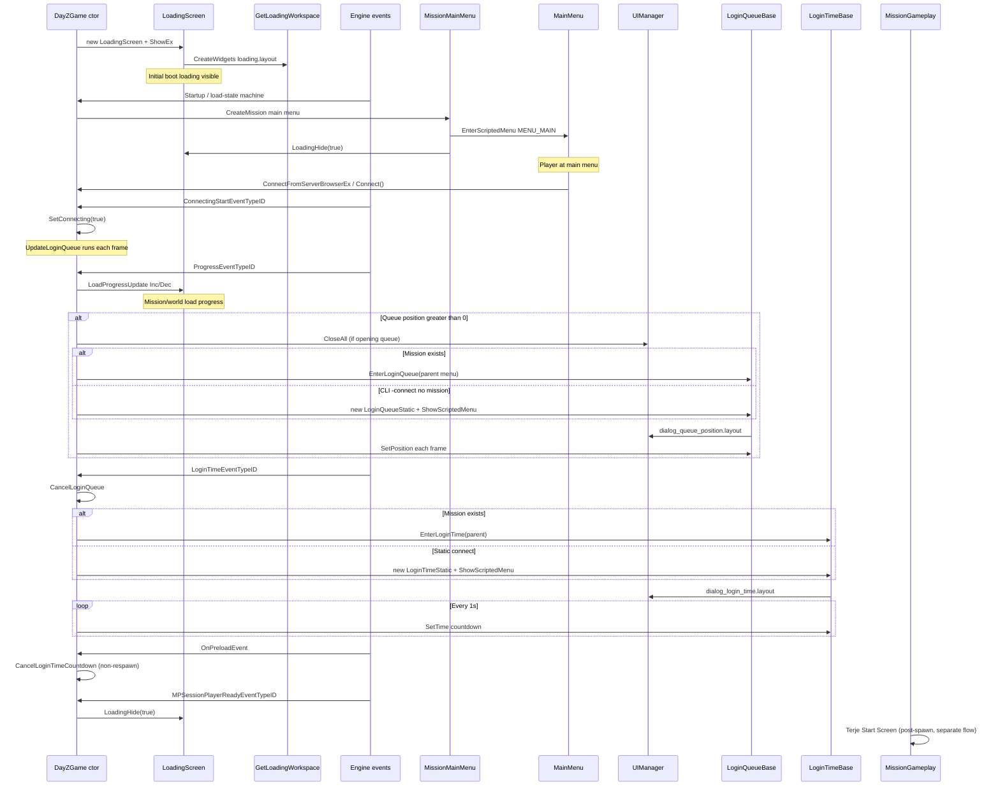
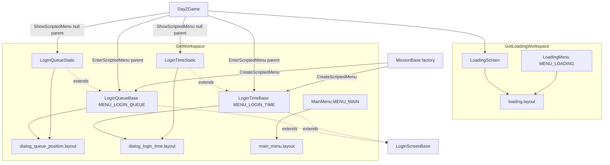

# Linked screen flows — connect / boot shell

DayZ reuses the same **loading-shell visual language** across several screens that appear back-to-back during cold start, server connect, queue wait, login timer, and mission load. PlayZUI milestone 2 should reskin these layouts as one **connect shell pack** so transitions do not flash mismatched backgrounds, hint chrome, or typography.

**Related:** [04-loading-screen-lifecycle.md](04-loading-screen-lifecycle.md) (engine `LoadingScreen` detail), [03-uimanager-flow.md](03-uimanager-flow.md) (menu stack), [05-screen-main-menu.md](05-screen-main-menu.md) (post-boot main menu).

---

## Executive summary

| Layer | Workspace | Primary layouts | Driven by |
|-------|-----------|-----------------|-----------|
| Engine loading overlay | `GetLoadingWorkspace()` | `loading.layout` | `LoadingScreen`, `LoadProgressUpdate` |
| Connect dialogs | `GetWorkspace()` | `dialog_queue_position.layout`, `dialog_login_time.layout` | `LoginQueueBase`, `LoginTimeBase` |
| Main menu (pre-connect) | `GetWorkspace()` | `new_ui/main_menu.layout` | `MissionMainMenu` → `MainMenu` |
| Pause hints (in-game, not connect) | `GetWorkspace()` | `day_z_ingamemenu.layout` + child hint layout | `InGameMenu` → `UiHintPanel` |

Queue and login-time dialogs are **not** children of `loading.layout`. They render on the normal UI workspace while `LoadingScreen` may still be visible on the loading workspace underneath. Visual consistency is layout-driven, not a single widget tree.

---

## Cold start → connect → in-game (sequence)

**Source Found:** `scripts/3_Game/DayZGame.c:994-1048` (boot `LoadingScreen`)
**Source Found:** `scripts/5_Mission/mission/missionMainMenu.c:83-90` (`LoadingHide` on main-menu mission start)
**Source Found:** `scripts/3_Game/DayZGame.c:1662-1666` (`ConnectingStartEventTypeID`)
**Source Found:** `scripts/3_Game/DayZGame.c:1838-1868` (`UpdateLoginQueue`)
**Source Found:** `scripts/3_Game/DayZGame.c:1872-1905` (`OnLoginTimeEvent`)
**Source Found:** `scripts/3_Game/DayZGame.c:1955-1963` (`OnPreloadEvent`)
**Source Found:** `scripts/3_Game/DayZGame.c:1510-1516` (`MPSessionPlayerReadyEventTypeID` → `LoadingHide`)

### Flow variants

| Entry | Load state | Queue / login path | Notes |
|-------|------------|-------------------|-------|
| Normal desktop boot | `MAIN_MENU_START` | Mission-backed: `EnterLoginQueue` / `EnterLoginTime` with parent menu | **Source Found:** `scripts/3_Game/DayZGame.c:1977-1985` |
| `-connect` / no mission yet | `CONNECT_START` | Static: `LoginQueueStatic`, `LoginTimeStatic` | **Source Found:** `scripts/3_Game/DayZGame.c:194-203`, `329-337` |
| `-join` (console) | `JOIN_START` | Same static/mission split once connecting | **Source Found:** `scripts/3_Game/DayZGame.c:2222-2234` |
| Respawn timer | In-game | Reuses `LoginTimeBase` with `SetRespawn(true)`; `dialog_login_time.layout` | **Source Found:** `scripts/3_Game/DayZGame.c:1927-1946` |
| Connect fail | — | `CancelLoginQueue`, `LoadingHide`, back to main menu | **Source Found:** `scripts/3_Game/DayZGame.c:1496-1507` |
| Leave queue / timer | — | `LoginScreenBase.Leave()` → disconnect, `MAIN_MENU_START` | **Source Found:** `scripts/3_Game/DayZGame.c:87-94` |

---

## Class → layout → parent relationships

| Class | MENU_* | Value | Layout | Factory / opener |
|-------|--------|-------|--------|------------------|
| `LoadingScreen` | — | — | `gui/layouts/loading.layout` | `DayZGame` ctor; `LoadProgressUpdate` | 
| `LoadingMenu` | `MENU_LOADING` | 12 | same | `MissionBase.CreateScriptedMenu` |
| `LoginQueueBase` | `MENU_LOGIN_QUEUE` | 30 | `gui/layouts/dialog_queue_position.layout` | `missionBase.c:277-278`; `EnterLoginQueue` |
| `LoginQueueStatic` | (same) | 30 | same | `DayZGame.UpdateLoginQueue` when `!GetMission()` |
| `LoginTimeBase` | `MENU_LOGIN_TIME` | 38 | `gui/layouts/dialog_login_time.layout` | `missionBase.c:280-281`; `EnterLoginTime` |
| `LoginTimeStatic` | (same) | 38 | same | `DayZGame.OnLoginTimeEvent` when `!GetMission()` |
| `MainMenu` | `MENU_MAIN` | 13 | `gui/layouts/new_ui/main_menu.layout` | `MissionMainMenu.OnInit` |

**Source Found:** `scripts/3_Game/constants.c:181`, `199`, `207`
**Source Found:** `scripts/5_Mission/mission/missionBase.c:277-281`

### Static vs mission-backed menus

| Flag | Set on | Behavior |
|------|--------|----------|
| `m_IsStatic = true` | `LoginQueueStatic`, `LoginTimeStatic` | `DayZGame` owns instance; `Hide()` + `delete` on cancel; `Update()` called from `DayZGame.OnUpdate` when not loading |
| `m_IsStatic = false` | Factory-created menus | `Close()` via UIManager; hint `Update` via normal menu tick |

**Source Found:** `scripts/3_Game/DayZGame.c:99-102`, `1402-1433`, `2987-2997`

---

## Dual workspace stacking

During connect, two independent widget roots can be visible:

1. **`LoadingScreen`** on `GetLoadingWorkspace()` — progress bar, logos, status line, `hint_frame`.
2. **Queue or login-time dialog** on `GetWorkspace()` — full-screen `Background`, centered dialog card, bottom hint band.

`LoadingScreen.Show()` hides any visible UIManager dialog before showing (`HideDialog`), but queue/login menus are scripted menus, not engine dialogs.

**Source Found:** `scripts/3_Game/DayZGame.c:841-844`
**Source Found:** `scripts/3_Game/DayZGame.c:713` vs `129`, `232` (workspace split)

Login status text routes to the active connect UI:

| Active screen | Login status target |
|---------------|---------------------|
| `m_LoginTimeScreen` | `SetStatus` → `txtDescription` (two lines) |
| `m_loading` only | `SetStatus` → `StatusText` (single combined line) |

**Source Found:** `scripts/3_Game/DayZGame.c:1644-1659`

---

## Shared connect-shell visual contract

These elements appear across `loading.layout`, `dialog_queue_position.layout`, and `dialog_login_time.layout` with matching names and similar placement. Keep them aligned in PlayZUI reskins.

| Widget / element | loading.layout | dialog_queue_position | dialog_login_time | Script usage |
|------------------|:--------------:|:---------------------:|:-----------------:|--------------|
| Full-screen backdrop | `ImageBackground` (masked progress) | `Background` | `Background` | Random/progress vs static image |
| Bottom scrim | `BottomPanel` | `BottomPanel` | `BottomPanel` | Decorative; 23% height, ~77% black |
| Hint mount (active) | `hint_frame` (in `BottomPanel`) | `hint_frame0` | `hint_frame0` | `UiHintPanelLoading` parent |
| Hint bulb icon | `hintIcon` | `hintIcon` | `hintIcon` | Layout-only; Expansion may swap image |
| Decorative lines | `LinesImageLeft`, `LinesRightImage` | same | same | Layout-only |
| Legacy hint mount | `hint_frame` (root duplicate) | `hint_frame` (root) | `hint_frame` (root) | **Not** used by connect scripts |
| Experimental disclaimer | `notification_root` | `notification_root` | `notification_root` | Hidden on PC; Xbox experimental |
| Console back bar | — | `toolbar_bg`, `BackIcon` | `toolbar_bg`, `BackIcon` | Console-only in `Init()` |
| Center card | logos + `LoadingBar` | `TextInputDialog` grid | `TextInputDialog` grid | Different content, same chrome |
| Red separator | — | `SeparatorPanel` | `SeparatorPanel` | Accent bar above body text |
| Leave / disconnect | — | `btnLeave` | `btnLeave` | `LoginScreenBase.Leave()` |

Default background texture shared by queue and login layouts: `{0DBE2630AF5047FD}Gui/textures/loading_screens/loading_screen_3_co.edds`.

**Source Found:** `gui/layouts/dialog_queue_position.layout:251-259`
**Source Found:** `gui/layouts/dialog_login_time.layout:107-115`
**Source Found:** `gui/layouts/loading.layout:48` (`ImageBackground` uses same texture family)

### Logo and progress (loading.layout only)

| Widget | Bound in `LoadingScreen` | Notes |
|--------|--------------------------|-------|
| `ImageLogoMid` | yes | Hidden when `MISSION_STATE_MAINMENU` |
| `ImageLogoCorner` | yes | Usually hidden |
| `LoadingBar` | yes | `ProgressAsync` drives fill |
| `ProgressText` | yes | Dev `loadingTest` CLI only |
| `StatusText` | yes | Login status when no login-time screen |
| `TextWidget` | yes | Load title from `LoadProgressUpdate` |
| `ModdedWarning` | yes | `ReportModded()` |
| `ImageLoadingIcon` | yes | Spinner (often hidden in layout) |

**Source Found:** `scripts/3_Game/DayZGame.c:714-724`, `846-858`

---

## dialog_queue_position.layout — widget map

**Source Found:** `gui/layouts/dialog_queue_position.layout`
**Source Found:** `scripts/3_Game/DayZGame.c:127-149`

| Widget | Type | Script binding |
|--------|------|----------------|
| `TextInputDialogRoot` | `PanelWidgetClass` | Root (`layoutRoot`) |
| `TextInputDialog` | `GridSpacerWidgetClass` | Center card container |
| `txtLabel` | `TextWidgetClass` | Label (string `#str_position_in_queue:`) |
| `SeparatorPanel` | `PanelWidgetClass` | Visual only |
| `txtPosition` | `MultilineTextWidgetClass` | **`m_txtPosition`** — queue number via `SetPosition` |
| `txtNote` | `MultilineTextWidgetClass` | **`m_txtNote`** — shown in `Init`, not populated in vanilla |
| `btnLeave` | `ButtonWidgetClass` | **`m_btnLeave`** — disconnect |
| `Background` | `ImageWidgetClass` | Full-screen art |
| `BottomPanel` | `PanelWidgetClass` | Hint band scrim |
| `hint_frame0` | `FrameWidgetClass` | **`UiHintPanelLoading`** parent (created in `Init`) |
| `hintIcon` | `ImageWidgetClass` | Bulb icon (`dayz_gui` / `loading_screen_bulb`) |
| `LinesImageLeft` / `LinesRightImage` | `ImageWidgetClass` | Decorative |
| `hint_frame` | `FrameWidgetClass` | Unused by scripts (legacy/alternate) |
| `notification_root` | `PanelWidgetClass` | Experimental disclaimer stack |
| `toolbar_bg` / `BackIcon` / `BackText` | console | Controller back affordance |

---

## dialog_login_time.layout — widget map

**Source Found:** `gui/layouts/dialog_login_time.layout`
**Source Found:** `scripts/3_Game/DayZGame.c:230-272`, `282-311`

| Widget | Type | Script binding |
|--------|------|----------------|
| `TextInputDialogRoot` | `WindowWidgetClass` | Root (`layoutRoot`) |
| `TextInputDialog` | `GridSpacerWidgetClass` | Center card |
| `txtLabel` | `TextWidgetClass` | **`m_txtLabel`** — countdown formatted text |
| `SeparatorPanel` | `PanelWidgetClass` | Visual only |
| `txtDescription` | `MultilineTextWidgetClass` | **`m_txtDescription`** — login status lines |
| `btnLeave` | `ButtonWidgetClass` | **`m_btnLeave`** |
| `Background` | `ImageWidgetClass` | Full-screen art |
| `BottomPanel` | `PanelWidgetClass` | Hint band |
| `hint_frame0` | `FrameWidgetClass` | **`UiHintPanelLoading`** — created in `Show()`, not `Init()` |
| `hintIcon` | `ImageWidgetClass` | Bulb icon |
| `LinesImageLeft` / `LinesRightImage` | `ImageWidgetClass` | Decorative |
| `hint_frame` | `FrameWidgetClass` | Unused by scripts |
| `notification_root` | `WrapSpacerWidgetClass` | Disclaimer (PC hidden) |
| `toolbar_bg` / `BackIcon` | console | Controller back |

Countdown strings: `#menu_loading_in_*` (login) vs `#dayz_game_spawning_in_*` (respawn) selected in `SetTime`.

**Source Found:** `scripts/3_Game/DayZGame.c:282-305`

---

## Hint system — loading vs in-game

Both paths read the same JSON catalog but use different child layouts and behavior.

| Aspect | Connect / loading (`UiHintPanelLoading`) | In-game pause (`UiHintPanel`) |
|--------|------------------------------------------|-------------------------------|
| Class | `UiHintPanelLoading` extends `UiHintPanel` | `UiHintPanel` |
| Child layout | `Gui/layouts/new_ui/hints/in_game_hints_load.layout` | `Gui/layouts/new_ui/hints/in_game_hints.layout` |
| Data | `scripts/data/hints.json` | same |
| Parent widgets | `hint_frame` (`LoadingScreen`) or `hint_frame0` (queue/login) | `hint_frame` (`day_z_ingamemenu.layout`) |
| Navigation | Prev/next buttons hidden in load layout | Full slideshow + manual buttons |
| Auto-advance | `LoginScreenBase.Update` → `ShowRandomPage` every 14s | 25s slideshow in base class |
| Min countdown guard | Login time: no hint swap if &lt; 8s remain | N/A |

**Source Found:** `scripts/3_Game/GUI/Hints/UiHintPanel.c:13-14`, `293-299`
**Source Found:** `scripts/3_Game/GUI/Hints/UiHintPanel.c:96-107` (child widget names: `HeadlineLabel`, `HintDescLabel`, `HintImage`, `LeftButton`, `RightButton`, `PageInfoLabel`)
**Source Found:** `scripts/3_Game/constants.c:1018-1019`
**Source Found:** `scripts/3_Game/DayZGame.c:69-78`, `187-189`, `323-325`
**Source Found:** `scripts/5_Mission/GUI/InGameMenu.c:49`

Load-hint child layout hides navigation chrome (`LeftButton`/`RightButton` frames `visible 0` in layout file).

**Source Found:** `gui/layouts/new_ui/hints/in_game_hints_load.layout:45-47`, `91-93`

---

## DayZLoadState touchpoints (connect-relevant)

**Source Found:** `scripts/3_Game/DayZGame.c:668-685`

| State | Typical UI |
|-------|------------|
| `UNDEFINED` → CLI branch | `-join` / `-connect` / main menu |
| `MAIN_MENU_*` | `MainMenu`, intro scene |
| `CONNECT_*` | Connect + loading + queue/login |
| `JOIN_*` | Console join flow |
| `MISSION_*` | Direct mission / in-game load |

Leaving queue/login via `Leave()` forces `MAIN_MENU_START` and disconnect.

**Source Found:** `scripts/3_Game/DayZGame.c:87-94`

---

## Expansion touchpoints (Sakhal)

Sakhal runs **limited** Expansion; connect-flow mods are minimal compared to Namalsk Adventure packs.

| Area | Sakhal-relevant? | What Expansion does |
|------|------------------|---------------------|
| `LoadingScreen` ctor | **Yes** | Swaps `ImageLogoMid` / `ImageLogoCorner` to Expansion iconset | 
| Namalsk Adventure loading pack | **No** (Namalsk module) | Custom backgrounds, `LoginQueueBase`/`LoginTimeBase` hint icon — not Sakhal pillar |
| `DayZGame` VanillaFixes | **Maybe** | Re-opens `LoginTimeBase` on respawn if screen was closed | 

**Source Found:** `DayZExpansion/DayZExpansion/Scripts/3_Game/DayZExpansion/Client/LoadingScreen/ExpansionLoadingScreen.c:13-29`
**Source Found:** `DayZExpansion/DayZExpansion/VanillaFixes/Scripts/3_Game/DayZExpansion_VanillaFixes/DayZGame.c:16-46`
**Source Found:** `PlayZ_Client/PlayZUI/docs/expansion/06-sakhal-limited-scope.md`

PlayZUI must preserve logo widget names on `loading.layout` so Expansion logo swap still works. Queue/login layouts are vanilla-only unless PlayZ adds overrides.

Terje Start Screen is **post-spawn** (after `MPSessionPlayerReady`), not part of the connect shell — see [terje/02-terje-start-screen.md](../terje/02-terje-start-screen.md).

---

## PlayZUI milestone 2 — connect shell pack checklist

Treat these assets as one deliverable; test connect end-to-end after any change.

### Layouts to reskin together

- [x] `gui/layouts/loading.layout` → `PlayZ_Client/PlayZUI/gui/layouts/playz_loading.layout`
- [x] `gui/layouts/dialog_queue_position.layout` → `playz_dialog_queue_position.layout`
- [x] `gui/layouts/dialog_login_time.layout` → `playz_dialog_login_time.layout`
- [x] `gui/layouts/dialog_input_password.layout` → PlayZUI override
- [ ] Optional cohesion: `gui/layouts/new_ui/hints/in_game_hints_load.layout` (hint typography/images inside shell)

### Widget names — do not rename

**loading.layout:** `ImageBackground`, `ImageLogoMid`, `ImageLogoCorner`, `LoadingBar`, `ProgressText`, `StatusText`, `TextWidget`, `hint_frame`, `ModdedWarning`, `notification_root`

**dialog_queue_position.layout:** `txtPosition`, `txtNote`, `txtLabel`, `btnLeave`, `hint_frame0`, `Background`, `BottomPanel`, `notification_root`, `toolbar_bg`, `BackIcon`

**dialog_login_time.layout:** `txtLabel`, `txtDescription`, `btnLeave`, `hint_frame0`, `Background`, `BottomPanel`, `notification_root`, `toolbar_bg`, `BackIcon`

**Hint child layout:** `HeadlineLabel`, `HintDescLabel`, `HintImage` (buttons optional on load variant)

### Visual parity checks

- [ ] Same background art (or same texture set) on `Background` / `ImageBackground`
- [ ] Matching `BottomPanel` height and scrim alpha across three layouts
- [ ] `hintIcon` + `LinesImageLeft` / `LinesRightImage` aligned consistently
- [ ] Shared `SeparatorPanel` accent and `TextInputDialog` card styling between queue and login
- [ ] `btnLeave` styling matches disconnect affordance on both dialogs

### Behavioral tests

- [ ] Desktop: main menu → server browser → connect → queue → login timer → in-game
- [ ] CLI: `-connect=IP -port=PORT` static `LoginQueueStatic` / `LoginTimeStatic` path
- [ ] `Leave` / `btnLeave` returns to main menu and disconnects
- [ ] Hints rotate on loading, queue, and login screens (~14s)
- [ ] Login timer hints stop changing when &lt; 8s remain
- [ ] `LoadingMenu` (`MENU_LOADING`) path if mission uses it — `LoadingBar` vs `ProgressBarWidget` mismatch per [04](04-loading-screen-lifecycle.md)
- [ ] Expansion logo swap still works on loading screen when Expansion loaded
- [ ] Respawn reuses login-time layout with spawn strings (`SetRespawn(true)`)

### Script override policy

Prefer **layout-only** overrides in PlayZUI. `LoginQueueBase`, `LoginTimeBase`, and `LoadingScreen` live in `DayZGame.c`; modding them duplicates engine glue. If layout paths change, patch via `modded class` `Init()` widget paths in PlayZUI scripts and document in [14-cross-reference-index.md](14-cross-reference-index.md).

---

## Related docs

- [04-loading-screen-lifecycle.md](04-loading-screen-lifecycle.md) — `LoadingScreen` / `LoadingMenu` engine detail
- [03-uimanager-flow.md](03-uimanager-flow.md) — `EnterScriptedMenu`, `CloseAll`
- [05-screen-main-menu.md](05-screen-main-menu.md) — connect entry from browser
- [06-screen-ingame-menu.md](06-screen-ingame-menu.md) — pause menu hints (`UiHintPanel`)
- [expansion/02-menu-overrides.md](../expansion/02-menu-overrides.md) — Expansion loading logo
- [BRIDGES.md](../BRIDGES.md) — connect shell pack bridge section
- [14-cross-reference-index.md](14-cross-reference-index.md) — lookup rows
